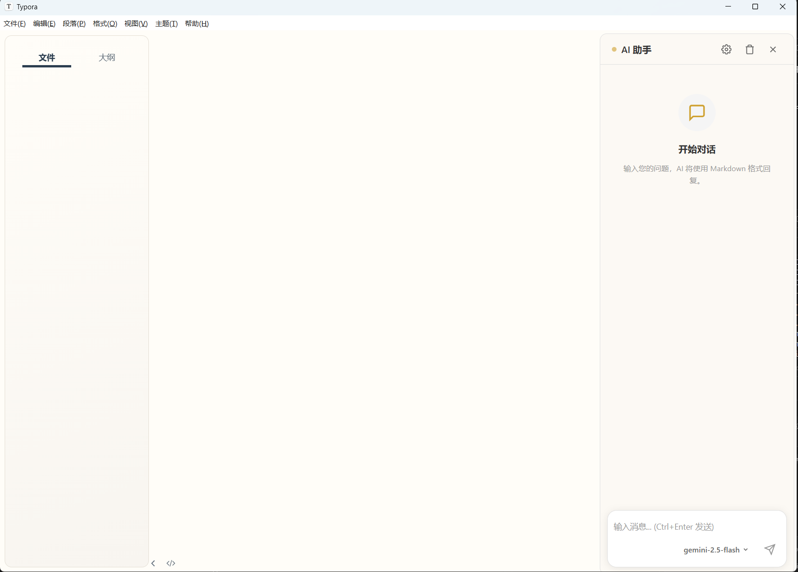

# Typora AI Chat Plugin

在 Typora 右侧添加 AI 聊天面板，支持自定义大模型、流式输出、Markdown 渲染，并可将代码块同步到编辑器。



## 功能特性

- 🎯 **右侧滑出式面板** - 不干扰编辑体验
- 🔄 **多模型切换** - 支持 OpenAI、DeepSeek 等兼容 API
- 📡 **流式输出** - 实时显示 AI 响应
- 📝 **Markdown 渲染** - 完美展示代码、列表、表格等
- ↔️ **拖拽调整宽度** - 自由调整面板大小

## 安装方法

### 自动注入（推荐）

1. **构建插件**

   ```bash
   cd \TyporaAIPlugin
   npm install
   npm run build
   ```

2. **找到 Typora 资源目录**

   - **Windows**: `C:\Program Files\Typora\resources\`
   - **macOS**: `/Applications/Typora.app/Contents/Resources/`
   - **Linux**: `/usr/share/typora/resources/`

3. **修改 window.html**

   打开 `resources/window.html`（官方版）或 `resources/app/window.html`（测试版），在 `</body>` 标签前添加：

   ```html
   <script src="./plugin/aiChat.js"></script>
   ```

4. **复制插件文件**

   将 `dist/aiChat.js` 复制到 Typora 的 `resources/plugin/` 目录（如不存在请创建）

5. **重启 Typora**


## 使用方法

### 打开面板

- 点击右下角的 AI 图标按钮
- 或按快捷键 `Ctrl + Shift + A`

### 配置模型

1. 点击面板右上角的设置图标 ⚙️
2. 填写 API Key 和其他配置
3. 点击保存

## 配置说明

插件配置存储在浏览器 LocalStorage 中，支持以下选项：

| 配置项 | 说明 | 默认值 |
|--------|------|--------|
| `endpoint` | API 地址 | https://api.openai.com/v1/chat/completions |
| `apiKey` | API 密钥 | (空) |
| `model` | 模型 ID | gpt-4o-mini |
| `maxTokens` | 最大 Token 数 | 4096 |
| `temperature` | 温度参数 | 0.7 |
| `systemPrompt` | 系统提示词 | (内置) |

### 添加自定义模型

在设置面板中修改配置，或通过开发者工具调用 API：

```javascript
// 获取当前配置
const config = window.aiChatPlugin.getConfig();

// 添加新模型
config.models.push({
    id: 'claude-3',
    name: 'Claude 3',
    endpoint: 'https://api.anthropic.com/v1/messages',
    apiKey: 'your-key',
    maxTokens: 4096,
    temperature: 0.7
});

// 保存配置
window.aiChatPlugin.setConfig(config);
```

## 快捷键

| 快捷键 | 功能 |
|--------|------|
| `Ctrl + Shift + A` | 打开/关闭面板 |
| `Ctrl + Enter` | 发送消息 |
| `Escape` | 关闭面板或设置 |

## 开发

```bash
# 安装依赖
npm install

# 构建
npm run build

# 输出文件在 dist/ 目录
```

### 目录结构

```
TyporaAIPlugin/
├── src/
│   ├── aiChat.css    # 样式源码
│   └── aiChat.js     # 逻辑源码
├── dist/
│   ├── aiChat.js     # 构建产物（含内联 CSS）
│   ├── aiChat.css    # 压缩后的 CSS
│   └── aiChat.min.js # 压缩后的 JS
├── build.js          # 构建脚本
├── package.json
└── README.md
```

## 注意事项

1. **API Key 安全**: API Key 存储在本地 LocalStorage，请勿在公共电脑上使用
2. **更新升级**: Typora 更新后可能需要重新注入插件
3. **兼容性**: 已测试 Typora 0.9.98+，旧版本可能存在兼容问题

## License

MIT
